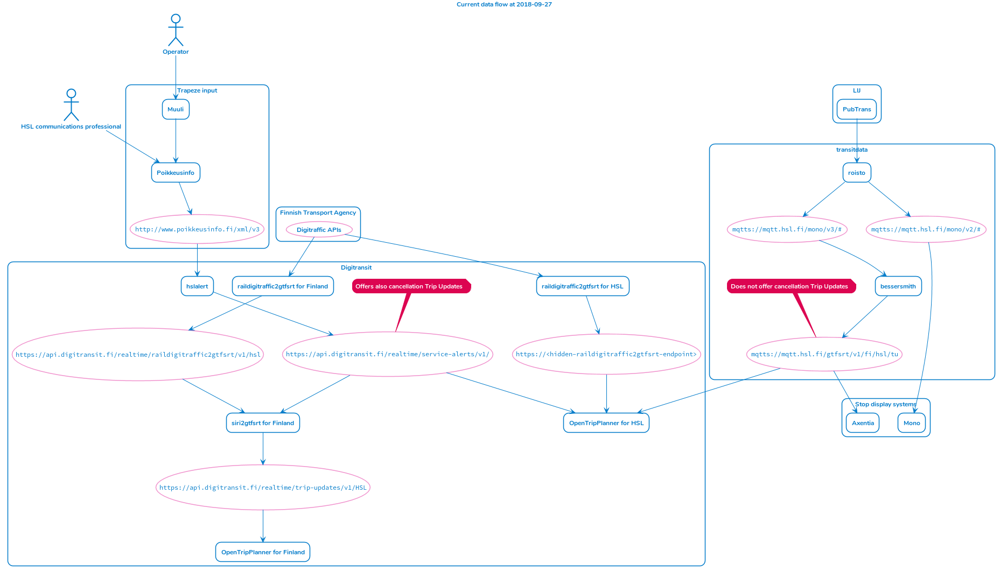
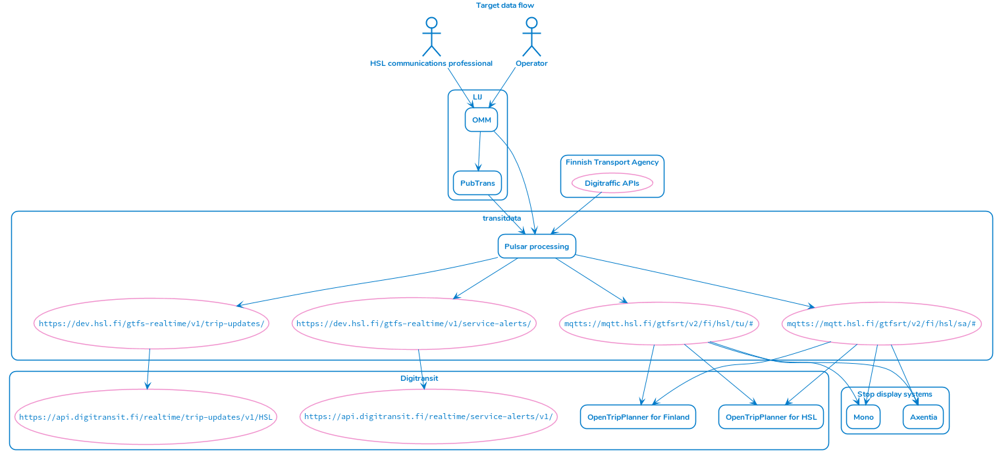
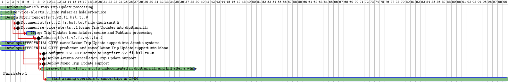
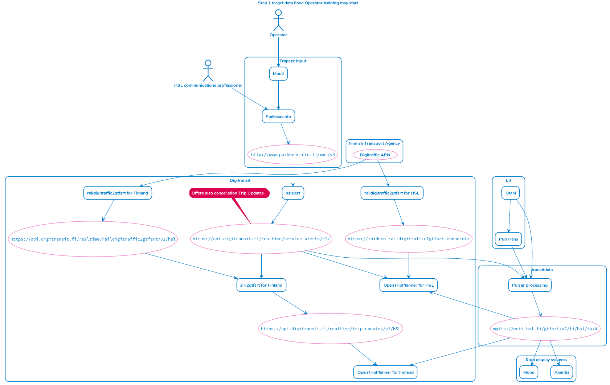

Transition is done and this documentation will be archived.

# HSL GTFS Realtime transition plan

HSL is going to deprecate the systems called Muuli and Poikkeusinfo.
Muuli is used for creating cancellation Trip Updates and Poikkeusinfo for Service Alerts, in GTFS Realtime terms.
The Poikkeusinfo API offers the output from both services.

Operational Monitoring and Management (OMM) will be used instead for both purposes.
At the same time, we can simplify the architecture for GTFS Realtime APIs.

No changes to the GTFS.zip contents or URLs are planned for this transition.

This transition requires:
- a long training period for teaching the public transport operators to use OMM instead of Muuli
- a short training period for the HSL employees to use OMM instead of Poikkeusinfo
- software development effort from several teams
- deprecating or changing public APIs and publishing new APIs

## Current situation

Notice how https://api.digitransit.fi/realtime/service-alerts/v1/ offers cancellation Trip Updates along with Service Alerts.

Notice how `mqtts://mqtt.hsl.fi/gtfsrt/v1/fi/hsl/tu` offers only prediction Trip Updates.

## Target state

We aim for a GTFS Realtime `FULL_DATASET` HTTP pull API and a GTFS Realtime `DIFFERENTIAL` MQTT push API.
The APIs will probably have separate HTTP endpoints and MQTT topic trees for different types of FeedEntities.
Both APIs should provide the same content.

Digitransit HTTP endpoints for the HSL area should offer the same data.

## Transition steps

The Gantt chart only visualizes work order.
Time estimates are not binding.

The suitable Gantt chart items should be transformed into issues in issue trackers if this transition plan is consented to.

### 1. Prepare for operator training

As operators move from Muuli to OMM in step 2, hslalert output will slowly lose all Trip Updates.

The Trip Updates should not be offered via the `service-alerts/v1` endpoint in the future, so it is fine that the API loses the Trip Update content.
Except for the fact that we will break backward compatibility with clients that rely on those Trip Updates.

It is expected that most users use `service-alerts/v1` for Service Alerts.
Therefore instead of releasing `v2` that everyone has to migrate to but that is identical to `v1` in Service Alert content, we will deprecate Trip Updates in `v1` with just a warning in documentation.

The warning in [digitransit.fi](https://digitransit.fi/en/developers/apis/4-realtime-api/service-alerts/) might say: "Apologies! Unfortunately we are going to break this API over a transition period. Trip Updates informing of trip cancellations will be moved from this API into the MQTT Trip Update API. We are not bumping the version of `service-alerts` to `v2` due to the assumption that most users have used this API for Service Alerts all along."

There needs to be an API for the Trip Updates, though.

OpenTripPlanner currently allows only one source endpoint for FeedEntity message type per gtfs.zip feed.
Except combining a `DIFFERENTIAL` HTTP Trip Update API with a `DIFFERENTIAL` MQTT Trip Update API works.
This is currently the situation with the Digitransit HSL region OTP service reading both a hidden raildigitraffic2gtfsrt endpoint modified to offer `DIFFERENTIAL` FeedMessages and the MQTT topic `gtfsrt/v1/#`.

Due to the current OTP restrictions, the easiest way forward is to publish `DIFFERENTIAL` Trip Updates via MQTT.

For messages that need to be available for future subscribers, such as cancellations, we should use MQTT retained messages.
There can be only one retained message per topic.
Retained messages should be removed or overwritten when they are no longer relevant.
The MQTT 5.0 specification offers an expiry interval for each message but we use MQTT 3.1.1.
In MQTT 3.1.1, the removal or overwriting has to be done explicitly.

### 2. Start training and guiding operators to cancel trips in OMM

## Cast members

### People, teams and organizations

- transitdata: HSL team
- Digitransit: HSL, FTA and LMJ team
- Trapeze
- Axentia
- Operators (users)
- HSL communications professionals (users)
- Lippu- ja informaatiojärjestelmä (LIJ) vendors
- Unknown third parties using the public APIs!

### Systems

- [hslalert](https://github.com/HSLdevcom/hslalert): Transform Poikkeusinfo XML API output into GTFS Realtime Service Alerts and cancellation Trip Updates.
- [siri2gtfsrt](https://github.com/HSLdevcom/siri2gtfsrt): Data merging service. One configuration, one Docker image, two instances running in Digitransit production.
- [raildigitraffic2gtfsrt](https://github.com/HSLdevcom/raildigitraffic2gtfsrt): Turn Liikennevirasto API output into GTFS Realtime Trip Updates.
- [OpenTripPlanner (OTP)](https://github.com/HSLdevcom/OpenTripPlanner): Trip planning engine for Digitransit
- Mono: Trapeze system for stop display management
- Poikkeusinfo: Trapeze system for communicating on exceptional circumstances
- Muuli: Trapeze system for cancelling trips
- Axentia: Axentia stop display management
- PubTrans: Hogia PubTrans
- OMM: Operational Monitoring and Management
- [roisto](https://github.com/HSLdevcom/roisto): Poll PubTrans and deliver custom prediction JSON messages over MQTT
- [bessersmith](https://github.com/HSLdevcom/bessersmith): Read roisto output and deliver GTFS Realtime prediction Trip Updates over MQTT
- Pulsar processing: Apache Pulsar and its clients
- mqtt.hsl.fi: The MQTT broker

### APIs and enpoints

Most of these APIs are public.
Some are not openly documented.

#### MQTT

- `mqtts://mqtt.hsl.fi/mono/v2/#`
    - Format: custom JSON
    - Content: predictions
    - No retained messages.
    - Not openly documented.
- `mqtts://mqtt.hsl.fi/mono/v3/#`
    - Format: custom JSON
    - Content: predictions
    - No retained messages.
    - Not openly documented.
- `mqtts://mqtt.hsl.fi/gtfsrt/v1/fi/hsl/tu`
    - Format: `DIFFERENTIAL` GTFS Realtime
    - Content: only prediction Trip Updates
    - No retained messages.
    - Not openly documented.
- `mqtts://mqtt.hsl.fi/gtfsrt/v2/fi/hsl/tu/#`
    - Format: `DIFFERENTIAL` GTFS Realtime
    - Content: Trip Updates
    - Retained messages used as necessary.
    - Does not exist yet.
    - Topic tree subject to change.
- `mqtts://mqtt.hsl.fi/gtfsrt/v2/fi/hsl/sa/#`
    - Format: `DIFFERENTIAL` GTFS Realtime
    - Content: Service Alerts
    - Retained messages used as necessary.
    - Does not exist yet.
    - Topic tree subject to change.

#### HTTP

- https://api.digitransit.fi/realtime/service-alerts/v1/ (currently)
    - Format: `FULL_DATASET` GTFS Realtime
    - Content: Service Alerts and Trip Updates
- https://api.digitransit.fi/realtime/service-alerts/v1/ (after step 2)
    - Format: `FULL_DATASET` GTFS Realtime
    - Content: Service Alerts
- https://api.digitransit.fi/realtime/trip-updates/v1/HSL
    - Format: `FULL_DATASET` GTFS Realtime
    - Content: Trip Updates
- http://www.poikkeusinfo.fi/xml/v3
    - Format: Custom XML
    - Content: Cancellations and service notices with varying metadata
- https://api.digitransit.fi/realtime/raildigitraffic2gtfsrt/v1/hsl
    - Format: `FULL_DATASET` GTFS Realtime
    - Content: municipal train Trip Updates
    - Previously documented in digitransit.fi but not openly documented anymore.
- `https://<hidden-raildigitraffic2gtfsrt-endpoint>`
    - Format: `DIFFERENTIAL` GTFS Realtime
    - Content: municipal train Trip Updates
    - Not openly documented.
    - Created to enable OTP to use both this API and `mqtts://mqtt.hsl.fi/gtfsrt/v1/fi/hsl/tu` at the same time.
- Liikennevirasto Digitraffic APIs
    - The source APIs for raildigitraffic2gtfsrt.
    - Websocket APIs exist but are not yet used by Digitransit or transitdata.
- `https://<hidden-hslalert-endpoint>`
    - Format: `FULL_DATASET` GTFS Realtime
    - Content: Service Alerts and Trip Updates
    - Required while both Poikkeusinfo and OMM are used for Service Alerts to pull the Poikkeusinfo content into Pulsar. At that time https://api.digitransit.fi/realtime/service-alerts/v1/ will just redirect to, reverse proxy to or cache Pulsar output.
- https://dev.hsl.fi/gtfs-realtime/v1/trip-updates/
    - Format: `FULL_DATASET` GTFS Realtime
    - Content: Trip Updates
    - Does not exist yet.
    - URL subject to change.
- https://dev.hsl.fi/gtfs-realtime/v1/service-alerts/
    - Format: `FULL_DATASET` GTFS Realtime
    - Content: Service Alerts
    - Does not exist yet.
    - URL subject to change.
